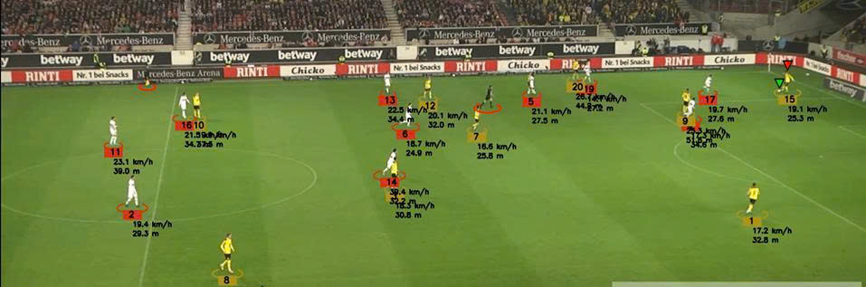

# ⚽ Football Tracking System - AI Computer Vision

<p align="center">
  🚀 Hệ thống phân tích video bóng đá sử dụng YOLOv8, Object Tracking và AI Pipeline hoàn chỉnh
</p>

---

## 📌 Tổng Quan

Dự án xây dựng hệ thống **phân tích video bóng đá end-to-end** sử dụng **Computer Vision và Deep Learning** để:

* Phát hiện cầu thủ và bóng
* Theo dõi chuyển động theo thời gian thực
* Phân tích hành vi và dữ liệu trận đấu

👉 Đây là một hệ thống mô phỏng **AI Sports Analytics Platform thực tế**

---

## 🎯 Tính Năng Chính

* 🎥 Phát hiện đối tượng với **YOLOv8**
* 🔄 Tracking cầu thủ theo ID xuyên suốt video
* ⚽ Gán bóng cho cầu thủ gần nhất
* 🧭 Chuyển đổi góc nhìn (top-view)
* 📏 Tính toán tốc độ & quãng đường
* 🔥 Heatmap di chuyển cầu thủ
* 👕 Phân đội dựa trên màu áo
* 🎨 Visualization (bounding box, overlay stats)

---

## 🖼️ Demo

### 📌 Output

<p align="center">
  
</p>

### 🎬 Video Demo

<p align="center">
  <a href="https://drive.google.com/file/d/10RdQbyuDMdFAaBrp8coeJ7m40OLBzCVC/view?usp=sharing">
    
  </a>
</p>


---

## 🧠 Công Nghệ Sử Dụng

* **Computer Vision:** YOLOv8, OpenCV
* **Deep Learning:** PyTorch
* **Tracking:** Object Tracking (custom pipeline)
* **Data Processing:** NumPy, Pandas
* **Visualization:** OpenCV / custom overlay
* **Ngôn ngữ:** Python

---

## ⚙️ Cấu Trúc Dự Án

```bash
football-tracking/
│
├── camera_movement_estimator/    # Ước lượng chuyển động camera
├── heatmap_generator/            # Tạo heatmap
├── mini_map/                     # Bản đồ mini sân bóng
├── player_ball_assigner/         # Gán bóng cho cầu thủ
├── speed_and_distance_estimator/ # Tính tốc độ & khoảng cách
├── team_assigner/                # Phân đội theo màu áo
│
├── trackers/                     # Tracking object
├── view_transformer/             # Transform góc nhìn
├── visualizations/               # Vẽ kết quả
├── utils/                        # Hàm tiện ích
│
├── input_video/                  # Video đầu vào
├── output_videos/                # Video đầu ra
├── models/                       # Model YOLO
│
├── training/                     # Training (nếu có)
├── tests/                        # Unit test
│
├── main.py                       # Pipeline chính
├── yolo_inf.py                   # Test YOLO
├── football_dashboard_app.py     # Dashboard
│
├── requirements.txt
└── README.md
```

---

## 🧠 Kiến Trúc Hệ Thống

Pipeline xử lý:

```
Video Input
   ↓
YOLO Detection
   ↓
Object Tracking (ID)
   ↓
Player-Ball Assignment
   ↓
Perspective Transform (Top View)
   ↓
Speed & Distance Calculation
   ↓
Visualization + Output Video
```

---

## 🛠️ Cài Đặt & Chạy

### 1. Tạo môi trường ảo

```powershell
python -m venv .venv
.\.venv\Scripts\Activate.ps1
```

---

### 2. Cài thư viện

```powershell
python -m pip install --upgrade pip
pip install -r requirements.txt
```

👉 Nếu có GPU:

https://pytorch.org/get-started/locally/

---

### 3. Chạy project

```powershell
python main.py
```

---

## 📂 File Quan Trọng

* `main.py` → Pipeline chính
* `trackers/` → Logic tracking
* `player_ball_assigner/` → Gán bóng
* `team_assigner/` → Phân đội
* `view_transformer/` → Transform góc nhìn

---

## ⚠️ Troubleshooting

* ❌ Thiếu thư viện:

  ```bash
  pip install supervision
  ```

* ❌ Video lỗi:
  → Kiểm tra `input_video/`

* ❌ Model lỗi:

  ```bash
  python yolo_inf.py
  ```

---

## 📈 Hướng Phát Triển

* 🔥 Player Re-identification (Re-ID)
* 📊 Tactical Analysis (chiến thuật)
* ⚡ Tối ưu FPS real-time
* 🌐 Deploy Web (Streamlit / FastAPI)
* 🤖 Kết hợp LLM để phân tích trận đấu

---

## 💡 Điểm Nổi Bật

* ✅ Thiết kế theo **modular architecture**
* ✅ Pipeline giống hệ thống AI thực tế
* ✅ Có nhiều module nâng cao:

  * Camera motion
  * Perspective transform
  * Heatmap
  * Tracking nâng cao

👉 Phù hợp với vị trí:
**AI Engineer / Computer Vision Engineer / ML Engineer**

---

## 👨‍💻 Tác Giả

**Lê Minh Đăng**
🔗 https://github.com/MinhDangk3

---

## ⭐ Ghi Điểm Với Nhà Tuyển Dụng

Dự án thể hiện:

* Xây dựng hệ thống AI hoàn chỉnh (end-to-end)
* Áp dụng Computer Vision vào bài toán thực tế
* Tư duy thiết kế hệ thống (System Design)
* Khả năng mở rộng và tối ưu

---

<p align="center">
🔥 Nếu bạn thấy project hữu ích, hãy ⭐ repo để ủng hộ!
</p>
